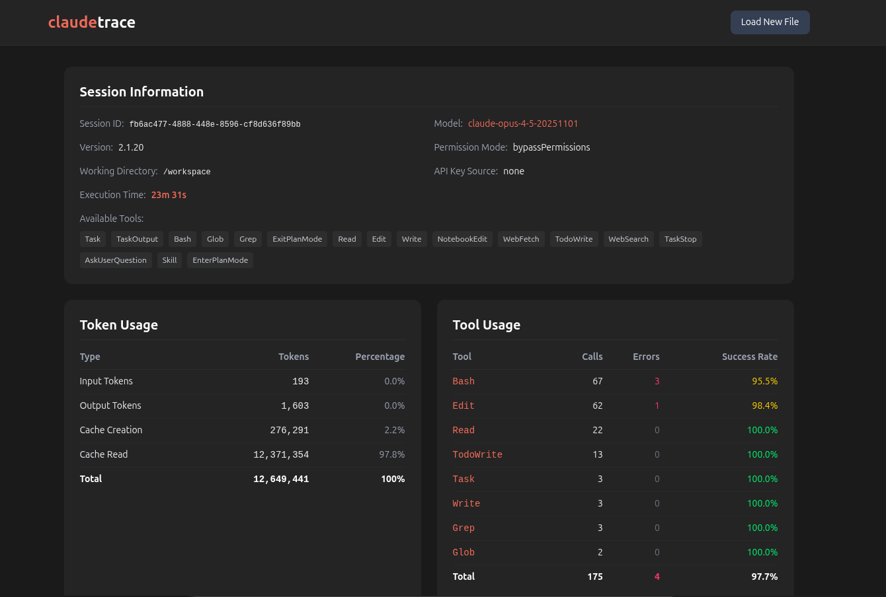

# claudelogs
A privacy-focused web viewer for Claude Code session logs. Analyze your AI coding sessions with detailed insights into conversations, tool usage, and token consumption - all processed locally in your browser.



## Why claudelogs?

When working with Claude Code, understanding how your sessions unfold can help you:
- **Optimize token usage** - See exactly where tokens are being spent
- **Debug tool failures** - Quickly identify which tool calls failed and why
- **Review conversations** - Browse through the full conversation history with proper formatting
- **Analyze patterns** - Understand your interaction patterns with the AI assistant

All processing happens **entirely in your browser** - no data is ever sent to any server.

## Features

- **Session Information** - View session metadata including model, version, working directory, available tools, and MCP servers
- **Token Usage** - Breakdown of input, output, cache creation, and cache read tokens with percentages
- **Tool Usage** - Statistics on tool calls with error counts and success rates
- **Conversation Flow** - Full conversation history with:
  - Complete text messages (not truncated)
  - Tool calls with full input parameters
  - Tool results with response content
  - Error highlighting for failed tool calls
  - Collapsible sections for long content

## Getting Started

### Installation

```bash
git clone https://github.com/lejdiprifti/claudelogs.git
cd claudelogs
npm install
```

### Development

```bash
npm run dev
```

Open http://localhost:5173 in your browser.

### Production Build

```bash
npm run build
```

The built files will be in the `dist/` directory.

### Preview Production Build

```bash
npm run preview
```

## How to Use

1. **Find your session log**
   Claude Code session logs are stored at:
   ```
   ~/.claude/projects/<project-path>/<session-id>.jsonl
   ```

2. **Upload the file**
   Open claudelogs in your browser and either:
   - Drag and drop the `.jsonl` file onto the upload area
   - Click "Browse Files" to select the file

3. **Explore your session**
   Navigate through the parsed data organized into sections:
   - **Session Info** - Model, tools, and configuration
   - **Token Usage** - Visual breakdown of token consumption
   - **Tool Usage** - Statistics on each tool with error rates
   - **Conversation Flow** - The complete conversation with expandable details

## Tech Stack

- React 19
- TypeScript
- Vite
- Tailwind CSS v4

## Developed By

**Lejdi Prifti**

- [Website](https://lejdiprifti.com)
- [X / Twitter](https://x.com/@lejdipr)
- [LinkedIn](https://linkedin.com/in/lejdi-prifti)
- [GitHub](https://github.com/lejdiprifti)

## License

MIT
